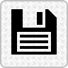
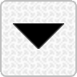

# User Guide

### Contents

- [Getting started](#getting-started)
- [User interface](#user-interface)
- [Scripts](#vpx-files)
- [Commands](#commands)
   - [`new module`](#new-module)
   - [`new input`](#new-input)
   - [`new label`](#new-label)
   - [`set background`](#set-background)
   - [`load script`](#load-script)
   - [`export panel`](#export-panel)

## Getting started

1. Create a new module that is 50.8mm (10 units) wide
   ```
   new module "bodacious" 1U 10H
   ```

2. Create vertical guidelines to locate inputs, outputs and parameters:
   ```
   new guide vertical @10.16mm
   ```
   ```
   new guide v1+10.16mm
   ```
   ```
   new guide v2+10.16mm
   ```
   ```
   new guide v3+10.16mm
   ```

3. Add a horizontal guideline to locate inputs, outputs and parameters:
   ```
   new guide horizontal top+20.32mm
   ```
   ```
   new guide h1+2H
   ```
   ```
   new guide bottom-15.24mm
   ```

4. Set the background:
   ```
   set background "foundation"
   ```

5. Create the inputs:
   ```
   new input "e" v1,h1 PJ301M
   ```
   ```
   new input "v" v1,h2 PJ301M
   ```

6. Create the outputs:
   ```
   new output "P" v3,h3-10.16mm PJ301M
   ```
   ```
   new output "Q" v3,h3         PJ301M
   ```

7. Create the parameters:
   ```
   new parameter "E" v2,h1 RoundBlackKnob
   ```
   ```
   new parameter "V" v2,h2 RoundBlackKnob
   ```

8. Create the lights:
   ```
   new light "ok" centre,middle LED
   ```
   ```
   new light "recording" centre,middle+12.7mm LED
   ```

9. Create the custom widget:
   ```
   new widget "channels" @40.64mm,20.32mm square
   ```

10. Add a title:
    ```
    new label "Thing 1" centre,g1 "StyleScript-Regular" 16pt centre,baseline
    ```

## User Interface

###  Load

- Clicking on the _Load_ button loads and renders a module saved as a _.vpd_ file.
- Alt-click on the _Load_ button loads and renders a _.vpx_ script file.


###  Save

- Clicking on the _Save_ button saves the current project as a _.vpd_ file, using the module name as a filename. `ctrl-click` will 
  save the project with a timestamped filename.

- `alt-click` on the _Save_ button saves the command history as a _.vpx_ script file, using the module name as a filename. 
  `ctrl-alt-click` will save the script with a timestamped filename.

###  Export SVG

- Clicking on the _Export SVG_ button saves the current panel as an SVG file that can be used as a resource.

###  Export SVG (dark)

- Clicking on the _Export dark SVG_ button saves the 'dark theme' panel as an SVG file that can be used as a resource. The SVG file is 
  saved with a _-dark_ suffix.


## Scripts

A _.vpx_ script file is simply a text file of VPD commands (one per line) that can be loaded (or dropped on to the panel design area) 
to recreate a module, e.g.
```
new module "bodacious" 1U 10H

new guide vertical @10.16mm
new guide v1+10.16mm
new guide v2+10.16mm
...
...
```

To load a _.vpx_ file:
- On the user interface _Alt-click_ (_Option-click_ on MacOS) the _File Load_ button () to open
  a file chooser dialog.

  -- or --

- Drag 'n drop a _.vpx_ file on to the user interface panels.

  -- or --

- Execute the `load script` command to open a file chooser dialog.


## Commands

##### Location formats

| Type     | `<xy>`   | Description                                                                | Example             |
|----------|----------|----------------------------------------------------------------------------|---------------------|
| **absolute** | `@x,y` | Absolute x,y location in mm relative to the top left corner of the panel | `@4.5mm,7.6mm`      |
| **relative** | `x,y`  | x,y location in mm relative to the origin                                | `4.5mm,7.6mm`       |
| **geometry** | `h,v`  | x,y location relative to the geometry of the panel                       | `left+4mm,top+10mm` |
| **guides**   | `h,v`  | x,y location relative to the guidelines                                  | `v1+4mm,h1-10mm`    |
   
The location units can be:
- `mm` (millimeters)
- `H` (standard horizontal units of 5.08mm)
- `h` (half-standard horizontal units of 2.54mm)

#### Parts

Components can be displayed on the _overlay_ layer as the physical representation of the component. The current list of
parts comprises:
- `RoundBlackKnob`
- `PJ301M`

An _unknown_ part will be displayed as an anonymous grey circle devoid of personality or future.

#### `new module`

```new module <name> [height] <width>```

Creates and initialises a new module.

_Command options:_
```
name     Module name, optionally surrounded by single or double quotes
height   (optional) panel height. The only valid values are 1U or 128.5mm
width    Panel width, in mm or _horizontal units_ (H) of 5.08mm. The width in mm 
         is rounded to the nearest integer multiple of 5.08mm (e.g. a value of 45mm
         is rounded 45.72mm)
```

_Notes:_

_Examples:_
```
new module bodacious 1U 5H
new module bodacious 1U 45mm
new module bodacious 45.72mm
````

#### `new input`

```new input <name> <xy> [part]```

Creates an input component _placeholder_ in the _components_ layer of the SVG and (optionally) displays the physical
input on the _overlay_ layer. The _overlay_ is for display only and is not exportedn to the resource SVGs when exported.

_Command options:_
```
name     Input name, optionally surrounded by single or double quotes and used by the VCV plugin helper scripts
         to generate the module skeleton. Should be unique unless you're deliberately trying to make the C++ \
         compiler miserable.
xy       Location of the centre of the input component. Must be one of the supported location formats (described 
         [above](#location-formats)).
part     (optional) Physical part to display on the overlay - a red circle is displayed on the overlay if a part
         is not provided.
```

_Notes:_

_Examples:_
```
new module bodacious 1U 5H
new module bodacious 1U 45mm
new module bodacious 45.72mm
````

#### `new label`

```new label <text> <xy> [font] [font-size] [halign,valign] [colour]```

Creates a text label and converts it to an SVG path.

_Command options:_
```
text       Label text, optionally surrounded by single or double quotes
xy         Location, either as absolute co-ordinates, relative to the origin or relative to the 
           geometry of the panel.
font       (optional) name of preloaded font. Defaults to RobotoMono-Bold.
font-size  (optional) font size (points). Defaults to 12pt.
halign     (optional) horizontal alignment (left, centre or right). Defaults to left.
valign     (optional) vertical alignment (top, middle, baseline or bottom). Defaults to baseline.
colour     (optional) text colour pair. The colour may be either standard colour names (e.g. red, blue),
                      RGB (e.g. #ff000) or RGBA (e.g. #ff000080). The default colours are #222222 for the
                      light themed panel and #ebebeb for the dark themed panel.
```

_Notes:_
1. The preloaded fonts are:
   - `Lato-Regular`
   - `Lato-Bold`
   - `RobotoMono-Regular`
   - `RobotoMono-Bold`
   - `RobotoCondensed-Regular`
   - `RobotoCondensed-Bold`
   - `StyleScript-Regular`
2. Font names are case- and space-insensitive

_Examples:_
```
new label "Lorem Ipsum" centre, top+10.16mm
new label "Lorem Ipsum" centre, top+10.16mm "Lato-Bold" 14.5pt centre
new label "Lorem Ipsum" centre, top+10.16mm "Lato-Bold" 14.5pt centre,baseline
new label "Lorem Ipsum" centre, top+10.16mm "Lato-Bold" 14.5pt centre,baseline red
new label "Lorem Ipsum" centre, top+10.16mm "Lato-Bold" 14.5pt centre,baseline #ffff0080
new label "Lorem Ipsum" centre, top+10.16mm "Lato-Bold" 14.5pt centre,baseline #ff0000,#00ff00
````


#### `set background`

```set background <rgb>[,<rgb>]|<rgba>[,<rgba>]|name```

Sets the panel background to either a plain colour or the name of a preloaded backround.

_Command options:_
```
rgb    RGB colour hex value e.g. #ff0000
rgba   RGBA colour hex value e.g. #ff000040
name   Name of a preloaded background definition, optionally surrounded by single or double quotes
```

_Notes:_
1. The default background is a transparent rectangle
2. `rgb` and `rgba` backgrounds can optionally specify a dark mode background colour.
3. The background name is case- and space-insensitive
4. The preloaded background are:
   - `foundation`

_Examples:_
```
set background #ff00ff
set background #ff00ff,#00ff00
set background #ff00ff40
set background #ff00ff40,#00ff0080
set background foundation
````

#### `load script`

```load script```

Opens a file chooser to load a `.vpx` script file.

_Example:_
```
load script
````

#### `export panel`

```export panel svg [light|dark]```

Exports the panel as an SVG for use as a plugin resource file.

_Command options:_
```
svg    (required) exports SVG file
light  (optional) exports the default panel SVG
dark   (optional) exports the dark themed SVG
```

_Notes:_

_Examples:_
```
export panel svg
export panel svg light
export panel svg dark
````

