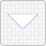
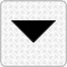

# VPD: VCV Rack 2 Panel Designer

VPD is a browser application to create the SVG files for a basic VCV module panel. 

It has been tested on:
- Chrome
- Firefox
- Opera
- Safari

(_but mostly on Chrome_).

There is a brief [Getting started](#getting-started) section below and a somewhat more comprehensive [user guide](GUIDE.md) which 
describes all the available commands.

**Status**: _very much still in development_

### Raison d’être

VPD was created mostly as an experiment in implementing a command interface using _tree-sitter_, but also because having to
switch back and forth between between text and paths in _Inkscape_ when creating or modifying a VCV panel is just plain annoying.


### Getting Started

Assuming that you have already installed the [VCV plugin SDK](https://vcvrack.com/manual/PluginDevelopmentTutorial):

1. Create a sample VCV plugin:
   ```
   $RACK_DIR/helper.py createplugin bodacious
   cd bodacious
   make
   ```
2. Open the VPD [web application](https://vpd.pages.dev) in your browser.

3. Create a sample panel by either:
   - Downloading the [_quickstart.vpd_](/doc/examples/quickstart.vpd) project file and opening it by clicking on the _Load_ 
     () button (or alternatively by executing the _load project_ command)

     -- OR --

   - Downloading the [_quickstart.vpx_](/doc/examples/quickstart.vpx) script file and opening it by **Alt-clicking** on the _Load_ 
     () button (or alternatively by executing the _load script_ command)

     -- OR --

   - Following the [_Getting started_](GUIDE.md#getting-started) instructions in the _User Guide_

4. Export the SVG files to the plugin `res` folder using either the _Export SVG_ buttons 
   ( ) or 
   the commands:
   ```
   export panel svg
   export panel svg dark
   ```
5. Generate a module using the [VCV helper script](https://vcvrack.com/manual/Panel) and add the module to the _plugin_:
   ```
   $RACK_DIR/helper.py createmodule bodacious res/bodacious.svg src/bodacious.cpp
   ```
   _plugin.hpp_
   ```
   #pragma once
   #include <rack.hpp>

   using namespace rack;

   extern Plugin* pluginInstance;
   extern Model* modelBodacious;
   ```
   _plugin.cpp_
   ```
   #include "plugin.hpp"

   Plugin* pluginInstance;

   void init(Plugin* p) {
       pluginInstance = p;

       p->addModel(modelBodacious);
   }
   ```

6. Compile and link and (optionally) install:
   ```
   make
   make install
   ```

### Releases

## _web app_

The [VPD](https://vpd.pages.dev) web app is currently hosted on _Cloudflare Pages_.


## Running locally

### VPD application

1. Download the _vpd_ executable archive from a [release](https://github.com/transcriptaze/vpd/releases) or the latest
   [_nightly_](https://github.com/transcriptaze/vpd/actions/workflows/nightly.yml) build and extract it to a folder of 
   your choice.
2. Open the `vpd` application in a terminal window (on a _Mac_ you may have to _Ctrl-Open_ the file the first time to grant
   it permissions to run).
3. Open [http://localhost:9876](http://localhost:9876) in your browser.
4. Voilá, you're good to go!

#### Command line
```
vpd [--debug] [--port <port>] [--html <folder>]

Options:
--debug          Enables verbose internal debug logging
--port <port>    Serves the web application on the specifed port (the default port is 9876)
--html <folder>  External folder for the HTML files - by default it serves the web application
                 embedded in the executable. A tar.gz file with the base version of the HTML
                 can be downloaded from the Github releases or the latest 'nightly' build.
```

### Python

1. Download the _HTML_ artifact from either a [release](https://github.com/transcriptaze/vpd/releases) or the latest 
   [_nightly_](https://github.com/transcriptaze/vpd/actions/workflows/nightly.yml) build and unzip it to a folder.
2. Start an HTTP server to serve the unzipped files:
   ```
   cd vpd
   python3 -m http.server 9876 -d html
   ```

### NodeJS

1. Download the _HTML_ artifact from either a [release](https://github.com/transcriptaze/vpd/releases) or the latest
   [_nightly_](https://github.com/transcriptaze/vpd/actions/workflows/nightly.yml) build and unzip it to a folder.
2. Start an HTTP server to serve the unzipped files:
   ```
   cd vpd
   npx http-server html --port 9876
   ```
   
## Building from source

You need a **bunch** of tools:
- _make_ (optional but recommended)
- [_tree-sitter_](https://tree-sitter.github.io/tree-sitter)
- [_Rust_ 1.74+](https://www.rust-lang.org/tools/install)
- [_wasm-pack_](https://github.com/rustwasm/wasm-pack)
- [_wasm-bindgen_](https://github.com/rustwasm/wasm-bindgen)
- [_npm 1.16.32+_](https://www.npmjs.com/get-npm)
- [_sass_](https://sass-lang.com)
- [_eslint_](https://eslint.org)
- [_eslint-config-standard_](https://www.npmjs.com/package/eslint-config-standard)
- [_Docker_](https://www.docker.com)
- [_Go 1.21+_](https://go.dev)
- [_Python 3.9+_](https://www.python.org/downloads/)

**NOTES**: 

1. `apt install sass` on _Ubuntu_ installs `ruby-sass` which was marked **[obsolete](https://sass-lang.com/ruby-sass)**
   in 2019. Please follow the installation instructions on the [Sass homepage](https://sass-lang.com) to install
   the current version.

2. The _web app_ is not bundled because I cannot for the life of me figure out how to resolve all the wasm dependencies.


### Build instructions

1. Clone the repository
   ```
   git clone https://github.com/transcriptaze/vpd
   cd vpd
   ```
2. Start docker
3. Build everything:
   ```
   make build-all
   ```


## Attribution

1. `undo` icon by Michael Kussmaul from <a href="https://thenounproject.com/browse/icons/term/undo/" target="_blank" title="Undo Icons">Noun Project</a> (CC BY 3.0)
2. `redo` icon by Michael Kussmaul from <a href="https://thenounproject.com/browse/icons/term/redo/" target="_blank" title="redo Icons">Noun Project</a> (CC BY 3.0)
3. The remaining icons are from the [SVG Silh](https://svgsilh.com) project.

